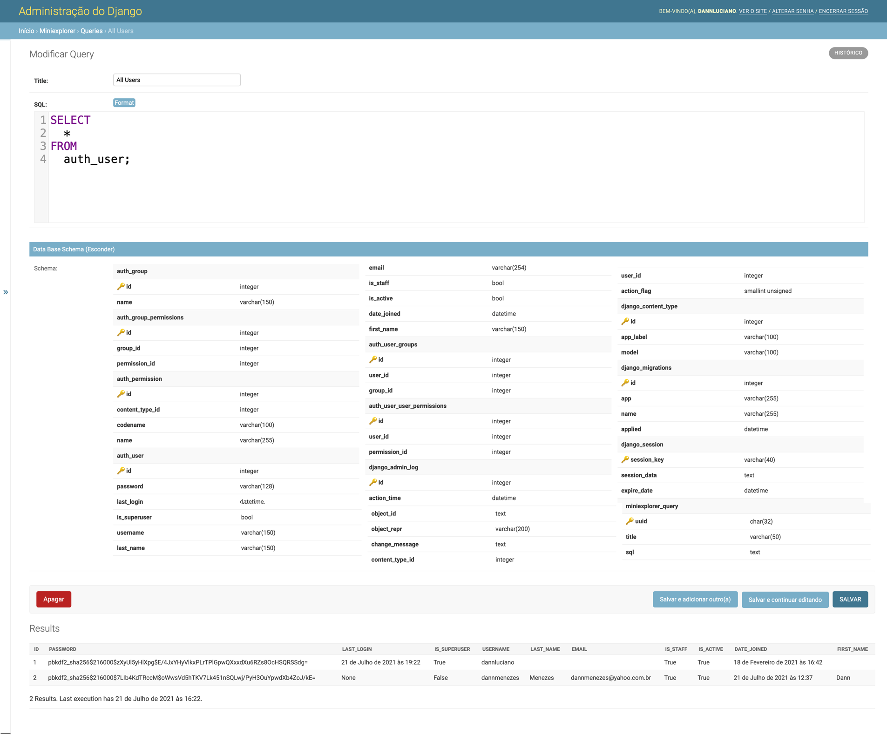

# django-miniexplorer

Mini SQL Explorer for Django Admin



## Features

- [x] SQL Explorer
- [x] Only safe SQL queries 
- [x] SQL querie formatting
- [x] Show data base schema
- [ ] Auto complete

## How to Install

```shell
$ pip install django-miniexplorer
```

## How to use

Add `'miniexplorer'` in your installed apps Django project `settings.py`

```python
# settings.py
INSTALLED_APPS = [
    "miniexplorer",
    ...
    "django.contrib.admin",
    "django.contrib.auth",
    "django.contrib.contenttypes",
    "django.contrib.sessions",
    "django.contrib.messages",
    "django.contrib.staticfiles",
]
```

Run `python manage.py migrate` and `python manage.py runserver`. 

Open your preferred Browser and go to `Admin Dashboard` normally in `127.0.0.1:8000` or `localhost:8000`.

## Authors

* **Dann Luciano** - *Initial work* - [@dannluciano](https://twitter.com/dannluciano)

See also the list of [contributors](https://github.com/dannluciano/django-miniexplorer/contributors) who participated in this project.

## License

This project is licensed under the MIT License - see the [LICENSE](./LICENSE) file for details

## Acknowledgments

Inspired:

* [django-sql-explorer](https://github.com/groveco/django-sql-explorer)
* and by Corona Virus

Thanks to [IFPI](https://www.ifpi.edu.br/) for pay my salary!


